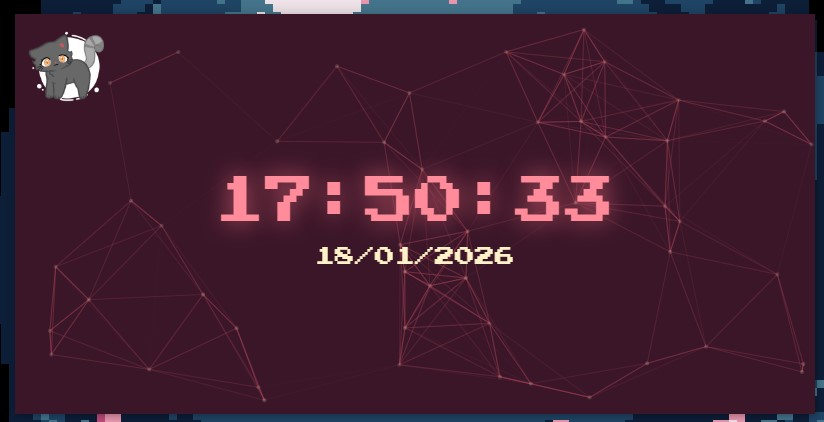

## 🕒 RelógioRTPJ - Electron JS

Este é um aplicativo de relógio digital para desktop minimalista e elegante, desenvolvido com Electron JS. O projeto apresenta um design customizado com animações de partículas ao fundo e uma interface sem bordas (*frameless*).

### 🚀 Tecnologias Utilizadas 

Para este projeto, utilizei uma stack moderna de desenvolvimento desktop e web:
- **Electron JS**: Framework para criação de aplicativos desktop nativos com tecnologias web.
- **JavaScript (ES6+)**: Lógica de atualização do relógio em tempo real.
- **HTML5 & CSS3**: Estrutura e estilização, utilizando variáveis CSS para gerenciamento de paleta de cores.
- **tsParticles**: Biblioteca utilizada para o efeito visual de partículas interconectadas ao fundo.
- **Google Fonts**: Uso da fonte "Press Start 2P" para um visual retro/pixel art.
- **Imagem Picrew**: procure por *Cat OC Maker*

### 🛠️ Funcionalidades

- **Relógio em Tempo Real**: Atualização dinâmica de horas e data local.
- **Janela Frameless**: A barra de título padrão do sistema operacional foi removida para um design mais limpo.
- **Draggable Interface**: Mesmo sem a barra de título, é possível arrastar a janela pelo desktop através da propriedade CSS `-webkit-app-region: drag`.
- **Background Animado**: Partículas dinâmicas que reagem ao ambiente da aplicação.
- **Resolução Fixa**: Janela configurada em $800 \times 400$ pixels, não redimensionável para manter a integridade do layout.

### 📁 Estrutura do Projeto
- `src`: Contém as imagens do projeto.
- `main.js`: Script de entrada do Electron onde a janela principal é configurada e criada
- `index.html`: Estrutura da interface e scripts de inicialização do relógio e partículas.
- `style.css`: Estilização completa, definições de cores e layout 
- `Flexbox.package.json`: Gerenciamento de dependências e metadados do projeto.

### 📷 Imagem do projeto



<br>
<hr>

### 🔧 Como Executar
Se você deseja clonar e rodar este projeto localmente, siga os passos abaixo:

1. Clone o repositório:

````bash

git clone https://github.com/seu-usuario/gravacao-electron.git

````

2. Instale as dependências:

````Bash

npm install -g electron
npm init -y
npm install electron --save-dev 

````

3. Inicie a aplicação: No seu ``package.json``, recomendo adicionar o script de start. Caso não tenha, você pode rodar:

````Bash

npx electron .

````

### 💡 Aprendizados Técnicos
Durante o desenvolvimento, apliquei conceitos importantes de:

- **Processos do Electron**: Diferença entre o processo principal ``(main.js)`` e o processo de renderização (``index.html``).

- **Customização de Janela**: Uso de ``frame: false`` e transparent: false na API ``BrowserWindow``.

- **Manipulação de DOM**: Uso de ``setInterval`` para garantir que o relógio reflita o tempo exato do sistema operacional a cada segundo.

<br>

<p align="center">Desenvolvido por  ``Ruth Ellen`` 👩‍💻</p>